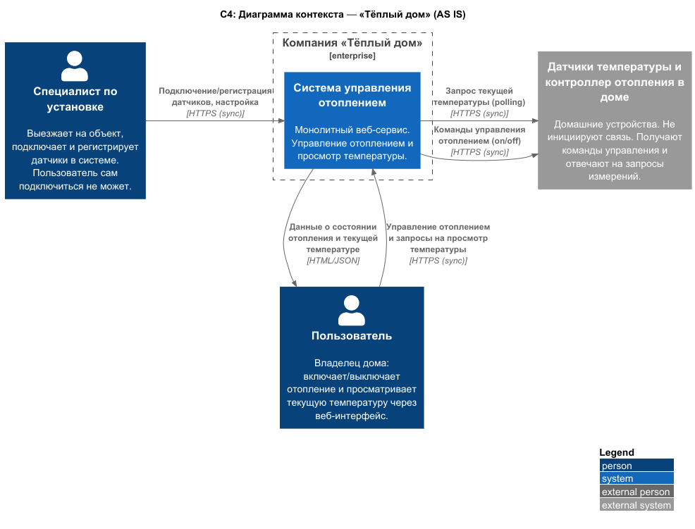
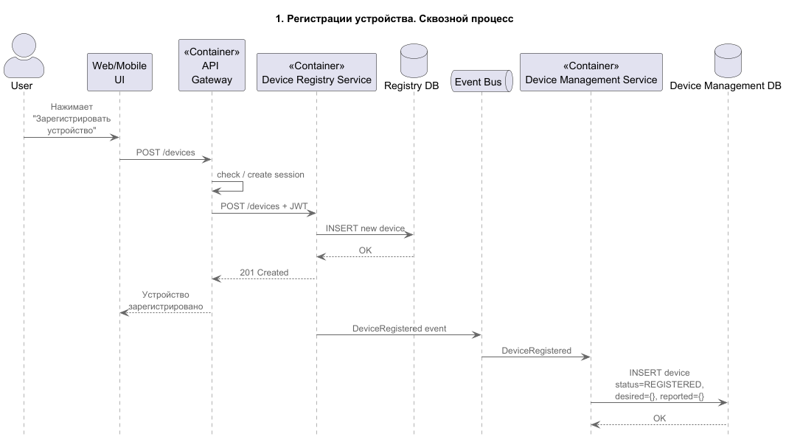
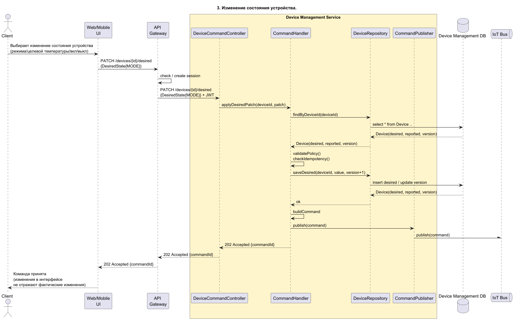
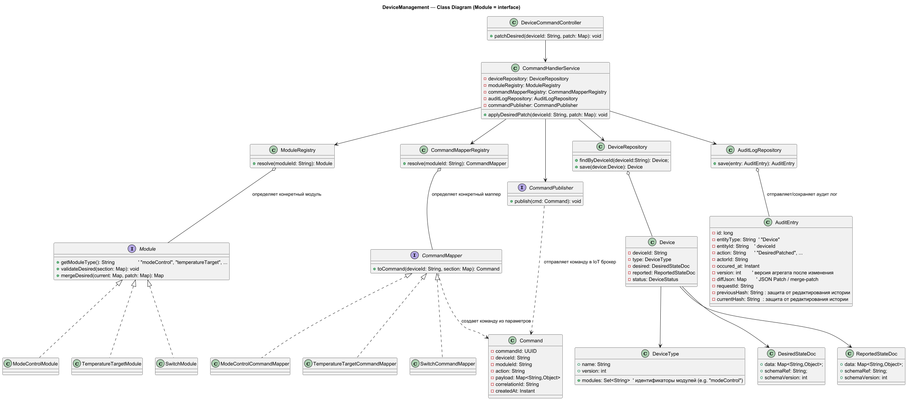
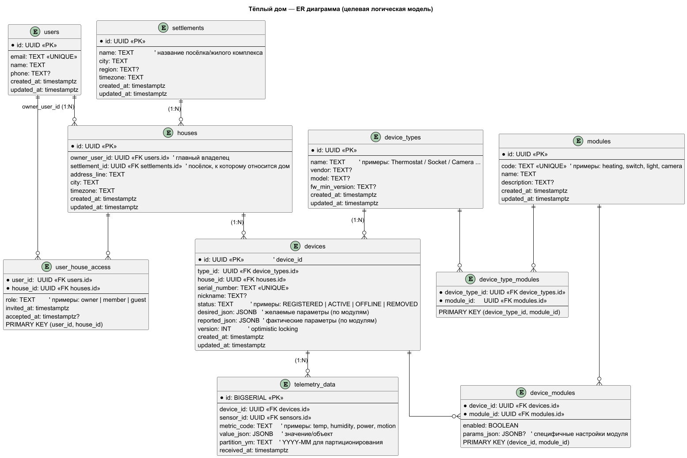
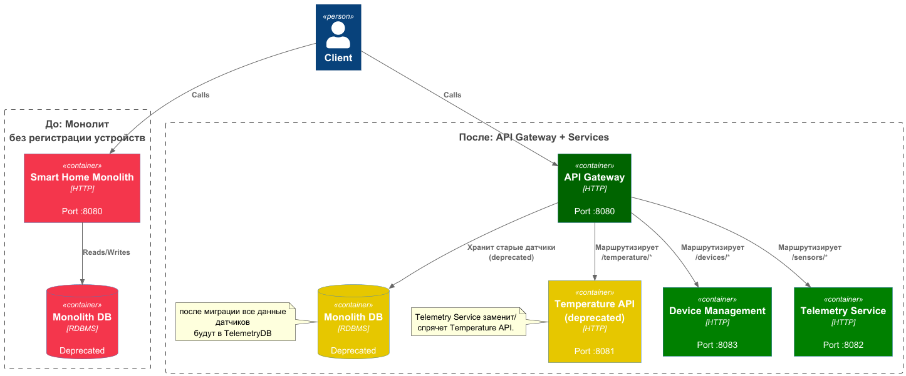
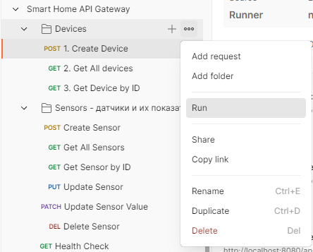
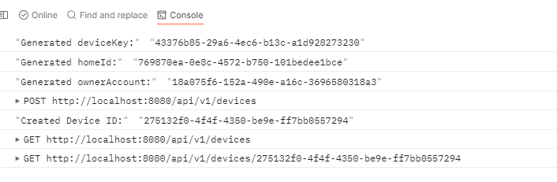

# Project_template

# Задание 1. Анализ и планирование


### 1. Описание функциональности монолитного приложения

**Управление отоплением:**

- Пользователи могут удалённо включать/выключать отопление в своих домах.

**Мониторинг температуры:**

- Пользователи могут просматривать текущую температуру в своих домах через веб-интерфейс.
- Система получает данные о температуре с датчиков, установленных в домах.

### 2. Анализ архитектуры монолитного приложения

- Язык программирования: Go
- База данных: PostgreSQL
- Архитектура: Монолитная, все компоненты системы (обработка запросов, бизнес-логика, работа с данными) находятся в рамках одного приложения.
- Взаимодействие: Синхронное, запросы обрабатываются последовательно.
- Масштабируемость: Ограничена, так как монолит сложно масштабировать по частям.
- Развертывание: Требует остановки всего приложения.

### 3. Определение доменов и границы контекстов

В системе выделены домены, поддомены и ограниченные контекстов:
- Домен: Управление устройствами
  - Поддомен: Отопление
    - Контекст: Управление отоплением 
      - включение/выключение отопления

- Домен: Телеметрия
  - Поддомен: Температура
    - Контекст: Мониторинг температуры 
      - опрос датчиков температуры
      - просмотр метрик пользователем

- Домен: Подключение оборудования
  - Поддомен: Установка специалистом
    - Контекст: регистрация устройства через выезд специалиста

Примечание: несмотря на то, что сейчас установка оборудования производится вручную специалистом, здесь также существует производственный контекст. При добавлении самообслуживания домен будет расширяться.

### **4. Проблемы монолитного решения**

- Разные нефункциональные требования. Модули имеют различные требования к доступности, времени ответа и безопасности хранению данных. Общая БД и общий контейнер развертывания лишает возможность фокусироваться на важных требованиях и экономить ресурсы там, где это допустимо. В монолите они вынуждены обслуживаться одинаково, что приводит к неэффективности и рискам недоступности критичных функций (например, отопления).
  - Высокая стоимость поддержки инфраструктуры. Требования самого критичного модуля (например, отопления с SLA 99,99%) распространяются на всю систему. Это вынуждает использовать дорогостоящую инфраструктуру для всех функций, даже тех, которые могли бы работать с более низкими гарантиями.
  - Ограниченная масштабируемость. Не вся функциональность обладает одинаковыми требованиями по нагрузке. Нет возможности гибко управлять ресурсами.
  - Тесная связность. Рост нагрузки или ошибка в одной части приложения влияет на производительность и доступность всего решения.
  - Низкая отказоустойчивость. При падении монолита недоступна вся функциональность; нет изоляции по доменам.
- Риски безопасности. Сложнее организовать минимально достаточный доступ к чувствительным данным, когда они все находятся в одной БД.
- Замедление поставки ценности/проверки гипотез. Любое изменение требует пересборки и выката всего монолита. Это замедляет цикл поставки, получение обратной связи и исправление дефектов.
- Трудности межкомандного взаимодействия. При расширении функциональности и добавлении новых команд усложняется коммуникация. Возникает необходимость договариваться о правилах и границах, без чего, есть риск конфликтов, долгой синхронизации и ошибок.
- Трудности с технологическим развитием. 
  - Сложнее менять версии зависимостей, библиотек и внедрять более современные инструменты.
  - Команды не могут выбрать другой технологический стек для новых частей системы, не затронув монолит.
- Ручное подключение новых устройств. Не относится к "монолиту", но относится к текущей системе. Пользователь не может сам подключить устройство, что тормозит масштабирование бизнеса.

### 5. Визуализация контекста системы — диаграмма С4

[Контекстная диаграмма](./schemas/context_c4_as_is.puml)


# Задание 2. Проектирование микросервисной архитектуры

- [Диаграмма контейнеров Containers](./schemas/container_c4_to_be.puml)

## Диаграмма компонентов (Components)**

**Контейнеры**:
- [DeviceManagement](schemas/c4-components/component_device_management_c4.puml)
- [Device Registry](schemas/c4-components/component_device_registry_c4.puml)
- [Telemetry](schemas/c4-components/component_telemetry_c4.puml)
- [Access Service](schemas/c4-components/component_access_c4.puml)
- [Spaces Registry](schemas/c4-components/component_spaces_c4.puml)

**Диаграмма кода (Code)**

1. [Регистрация](schemas/c4-code/1_sequence-registration.puml)

2. [Актуализация состояния устройства](schemas/c4-code/3_sequence-changeState.puml)
3. [Изменение состояния устройства](schemas/c4-code/2_sequence-applyReported.puml)


5. [Диаграмма классов контейнера DeviceManagement](schemas/c4-code/class-changeState.puml)


# Задание 3. Разработка ER-диаграммы

[erd схема](schemas/erd.puml)


# Задание 4. Создание и документирование API

### 1. Тип API

Мы используем синхронный HTTP API (REST) между компонентами, где критична простота интеграции и предсказуемость ответов (например, чтение текущей температуры, CRUD устройств). Для обмена событиями в перспективе (например, изменение состояния устройства) предусмотрен асинхронный канал через брокер сообщений, но в MVP остаёмся на REST. 

### 2. Документация API

Здесь приложите ссылки на документацию API для микросервисов, которые вы спроектировали в первой части проектной работы. Для документирования используйте Swagger/OpenAPI или AsyncAPI.

# Задание 5. Работа с docker и docker-compose

Перейдите в apps.

Там находится приложение-монолит для работы с датчиками температуры. В README.md описано как запустить решение.

Вам нужно:

1) сделать простое приложение temperature-api на любом удобном для вас языке программирования, которое при запросе /temperature?location= будет отдавать рандомное значение температуры.

Locations - название комнаты, sensorId - идентификатор названия комнаты

```
	// If no location is provided, use a default based on sensor ID
	if location == "" {
		switch sensorID {
		case "1":
			location = "Living Room"
		case "2":
			location = "Bedroom"
		case "3":
			location = "Kitchen"
		default:
			location = "Unknown"
		}
	}

	// If no sensor ID is provided, generate one based on location
	if sensorID == "" {
		switch location {
		case "Living Room":
			sensorID = "1"
		case "Bedroom":
			sensorID = "2"
		case "Kitchen":
			sensorID = "3"
		default:
			sensorID = "0"
		}
	}
```

2) Приложение следует упаковать в Docker и добавить в docker-compose. Порт по умолчанию должен быть 8081

3) Кроме того для smart_home приложения требуется база данных - добавьте в docker-compose файл настройки для запуска postgres с указанием скрипта инициализации ./smart_home/init.sql

Для проверки можно использовать Postman коллекцию smarthome-api.postman_collection.json и вызвать:

- Create Sensor
- Get All Sensors

Должно при каждом вызове отображаться разное значение температуры

Ревьюер будет проверять точно так же.


# **Задание 6. Разработка MVP**

# **Реализация MVP: Микросервисная архитектура**

## **Что было реализовано**

### **1. Созданные микросервисы:**

- **Device Management Service** (Java/Spring Boot) - управление устройствами
- **Telemetry Service** (Java/Spring Boot) - сбор и хранение телеметрии
- **Temperature API** (Java/Spring Boot) - API для работы с температурными данными

### **2. API Gateway**

Монолитное приложение `smart-home` было преобразовано в **API Gateway**, который:
- Проксирует запросы к микросервисам
- Сохраняет локальную функциональность для датчиков
- Обеспечивает единую точку входа для всех API


### **3. Архитектура системы**
[GAP-анализ PlantUML](schemas/gap.puml)


## **Что изменилось в архитектуре**

1. **Монолит → API Gateway**: Приложение smart-home теперь работает как API Gateway
2. **Микросервисы**: Созданы отдельные сервисы для управления устройствами и телеметрии
3. **Интеграция**: Обеспечено **синхронное** взаимодействие между API Gateway и микросервисами
4. **Масштабируемость**: Каждый сервис может масштабироваться независимо
5. **Отказоустойчивость**: Падение одного сервиса не влияет на работу других
5. **Расширяемость**: Можно добавлять типы датчиков, регистрировать новые типы устройств и подключать синхронные/асинхронные источники, а также добавлять модули. 

**Отличия MVP от целевой архитектуры:**
- Отсутствие аутентификации и ролевой модели
- Нет управления пространствами - создание поселка, дома, комнаты
- В MVP DeviceRegistry - это модуль DeviceManagement. Разделение потребуется после реализации асинхронного взаимодействия и событийной модели изменения БД (оповещение об регистрации/обновлении/удалении устройства).
- Temperarure-api часть задания, поэтому висит отдельным сервисом, хотя является частью телеметрии. Может выступать, как продуктовый модуль (вертикаль) по типу сенсоров, если различия между датчиками станут критическими. Либо, может спрятаться за телеметрией (как резервный, синхронный опрос датчика, при обнаружении отставания).
- В монолите/gateway сохраняется часть логики, что может демонстрировать переходный период, когда еще не вся логика вынесена в микросервисы. Для получения метрик с датчиков температуры вызывается старое API, а для всех остальных - telemetry. 
- Монолит все еще сохраняет себе данные датчиков, что может демонстрировать избыточность переходного периода, когда не все данные мигрировали по своим сервисным/доменным БД.

## **Запуск системы**

### **Быстрый запуск:**

```bash
cd apps
./init.sh
```

### **Ручной запуск:**

```bash
cd apps
docker-compose up --build -d
```

### **Проверка статуса:**

```bash
docker-compose ps
```

### **Просмотр логов:**

```bash
# Все сервисы
docker-compose logs -f

# Конкретный сервис
docker-compose logs -f app
docker-compose logs -f device-management-service
docker-compose logs -f telemetry-service

# 

docker compose down -v
```
### **Убрать за собой:**
```bash
# останавливает контейнеры и удаляет volumes
docker compose down -v
```

## **Тестирование**

### **1. Postman коллекция**

Импортируйте `Smart Home API Gateway.postman_collection.json` в Postman и запустите коллекцию "Smart Home API Gateway".

**Коллекция использует:**
- Pre-request scripts для генерации уникальных UUID (deviceKey, homeId, ownerAccount),
- Tests для сохранения device_id в переменные коллекции



После выполнения в консоле отобразятся идентификаторы.



### **2. Тестовый скрипт**

```bash
cd apps
chmod +x test_api_gateway.sh
./test_api_gateway.sh
```

### **3. Ручное тестирование**

**Создание устройства:**
```bash
curl -X POST http://localhost:8080/api/v1/devices \
  -H "Content-Type: application/json" \
  -d '{
  	"deviceKey": "521f8d6f-6714-4818-b7f3-bc69f7990119",
  	"typeCode": "termostat",
  	"model": "termostat-super-bot",
  	"location": "Living Room", 
  	"homeId": "fa572980-e64d-44be-97ba-52081fa81e1b",
  	"ownerAccount": "c410ab19-22c0-49ff-b984-45ef7e6efddc",
  	"metadata": {
  	  "brand": "LG"
  	}
	}'
```

**Получение списка устройств:**
```bash
curl http://localhost:8080/api/v1/devices
```

**Создание датчика:**
```bash
curl -X POST http://localhost:8080/api/v1/sensors \
  -H "Content-Type: application/json" \
  -d '{
    "name": "Temperature Sensor",
    "type": "temperature",
    "location": "Living Room",
    "unit": "celsius"
  }'
```

## **Доступные API**

### **Device Management (через API Gateway)**
- `POST /api/v1/devices` - регистрация устройства
- `GET /api/v1/devices` - список устройств
- `GET /api/v1/devices/{id}` - получение устройства по ID

### **Sensors (локальные API + проксирование в telemetry)**
- `GET /api/v1/sensors` - список датчиков
- `POST /api/v1/sensors` - создание датчика
- `GET /api/v1/sensors/{id}` - получение датчика по ID
- `PUT /api/v1/sensors/{id}` - обновление датчика
- `DELETE /api/v1/sensors/{id}` - удаление датчика
- `PATCH /api/v1/sensors/{id}/value` - обновление значения датчика
- `GET /api/v1/sensors/temperature/{location}` - получение температуры по локации

## **Сервисы и порты**

- **API Gateway** (smart-home): `http://localhost:8080`
- **Device Management**: `http://localhost:8083`
- **Telemetry Service**: `http://localhost:8082`
- **Temperature API**: `http://localhost:8081`

## **Базы данных**

- **Основная БД** (smart-home): `localhost:15432`
- **Telemetry БД**: `localhost:25432`
- **Device Management БД**: `localhost:35432`


## **Документация**

- Подробная документация API Gateway: [apps/API_GATEWAY_README.md](apps/API_GATEWAY_README.md)
- Документация по запуску: [apps/README.md](apps/README.md) 